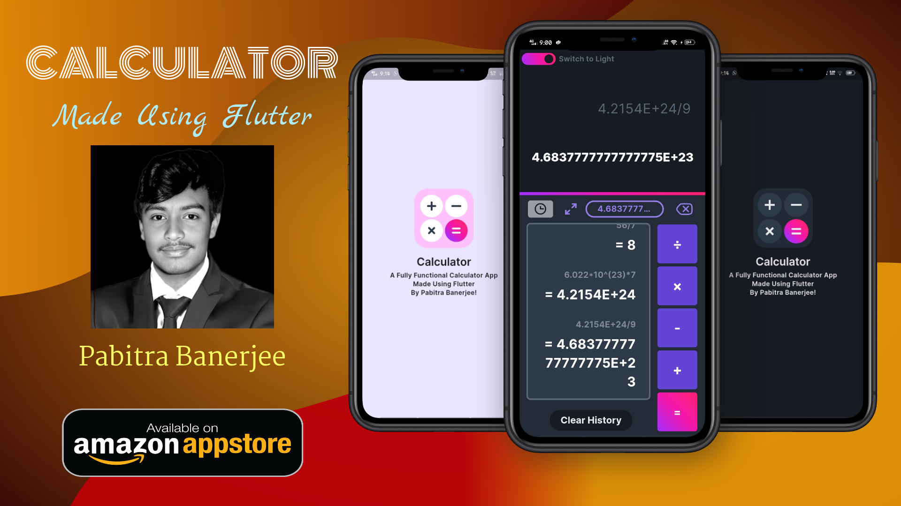
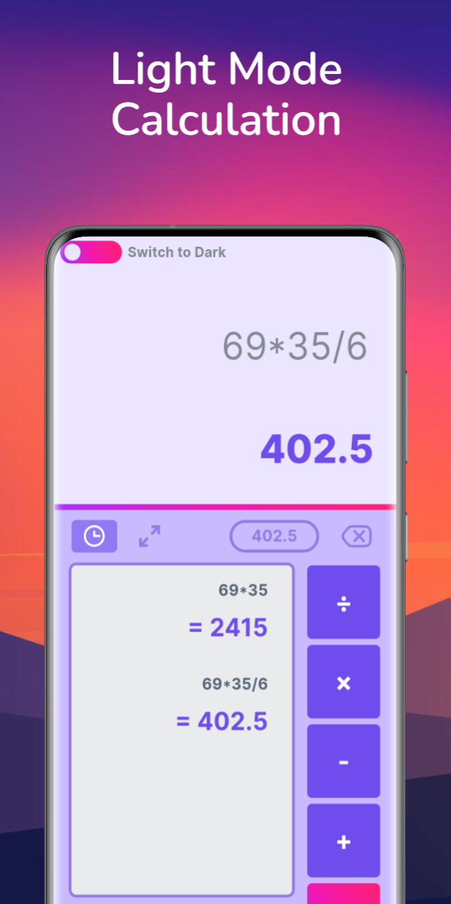
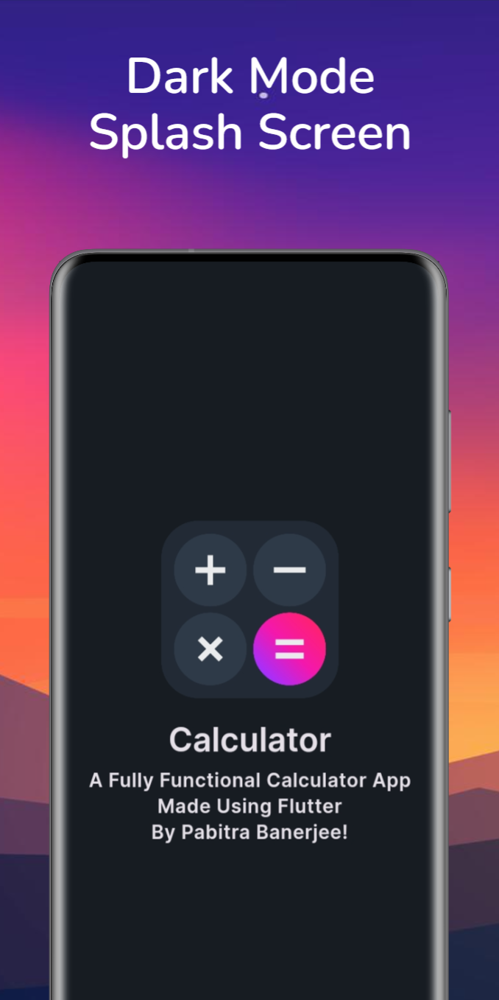
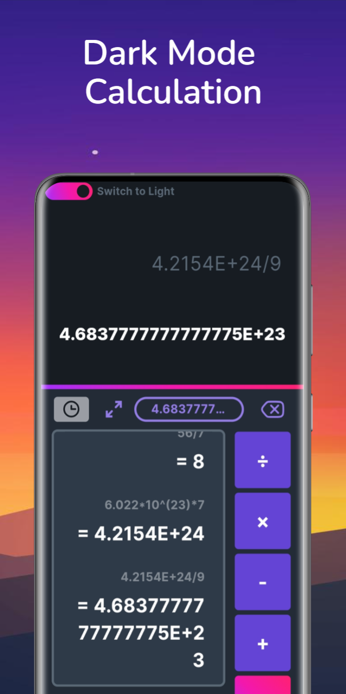

# Calculator

## About the Calculator App by Pabitra Banerjee

The Calculator app, developed by Pabitra Banerjee, is a versatile and feature-rich tool designed to cater to a wide range of mathematical needs. This lightweight and open-source application is crafted with a focus on user privacy, usability, and functionality. Here's a closer look at what makes this app stand out:

## Calculator App Features

This lightweight calculator app offers a robust and versatile user experience while maintaining a minimalist and user-friendly design. Here’s a detailed look at its features:

### 1. Lightweight and Secure
- **No User Data Collection**: This app ensures complete privacy as it does not collect any user data.
- **Open-Source**: The project is open-source, allowing users to review, modify, and enhance the code.

### 2. User Interface
- **Light Mode and Dark Mode**: Users can switch between light and dark themes to suit their preferences and reduce eye strain.
- **Responsive Input Font Size**: The input font size dynamically adjusts based on the length of the input, ensuring readability at all times.

### 3. Functionality
- **Basic Arithmetic Operations**: Supports addition, subtraction, multiplication, and division.
- **Advanced Mathematical Functions**:
  - Trigonometric functions (`sin`, `cos`, `tan`, and their hyperbolic and inverse variants)
  - Logarithmic functions (`log`, `log10`)
  - Power functions (`x²`, `x³`, `xʸ`, `2ˣ`, `eˣ`)
  - Factorial (`x!`)
  - Absolute value (`|x|`)
  - Square root (`√`)
- **Angle Unit Toggle**: Users can switch between radian and degree modes for trigonometric calculations.
- **Brackets Management**: Smart handling of parentheses for complex expressions.
- **Change Sign**: Easily change the sign of numbers within expressions.
- **Constants**: Includes mathematical constants like π and `e`.

### 4. Usability Enhancements
- **History Functionality**: Keeps a record of previous calculations for easy reference.
- **Scrollable Input Field**: The input field is scrollable to manage longer expressions efficiently.
- **Cursor Management**: Facilitates easy editing of expressions by allowing insertion and deletion at the cursor position.

### 5. User Interaction
- **Function Buttons**: Includes buttons for commonly used functions like `√`, `1/x`, and `eˣ`.
- **Power and Exponentiation**: Allows for easy exponentiation using `xʸ`, `x²`, and `x³`.
- **Toggle Buttons**: Switch between various modes (e.g., landscape row switch, angle type switch).

### 6. Error Handling
- **Approximate Result Calculation**: The app provides approximate results for expressions, formatted to five decimal places. It also ensures that results are displayed in the simplest form (e.g., converting floating-point results to integers when possible).

### 7. Intuitive Controls
- **Delete and Clear**: Easily delete the last character or clear the entire input.
- **Cursor Positioning**: Maintains cursor position during edits for seamless user experience.

### 8. Special Features
- **Function Addition with Multiplication**: Automatically adds a multiplication operator when functions or constants are added to ensure correct expression formatting.
- **Auto Bracket Closure**: Ensures that opened parentheses are closed appropriately to prevent syntax errors.

## About the Developer

Pabitra Banerjee, a Full-Stack AI Engineer and the Founder & CEO of MB WEBBER'S, is known for his dedication to spreading science and technology among the common people. With a passion for astrophysics and mathematics, Pabitra actively engages in creating innovative solutions that bridge the gap between technology and everyday life. This calculator app is a testament to his commitment to developing practical and user-centric applications.

## Technologies Used in the Calculator Project

The Calculator app developed by Pabitra Banerjee leverages a range of technologies and dependencies to deliver a seamless and efficient user experience. Here’s a breakdown of the key technologies and packages used in this project as specified in the `pubspec.yaml` file:

### Flutter SDK
- **Flutter**: The primary framework used for developing the app, allowing for a natively compiled application for mobile, web, and desktop from a single codebase.
- **SDK Version**: The project is built using Dart SDK version `>=3.4.3 <4.0.0`, ensuring compatibility with the latest features and improvements.

### UI and Icons
- **Cupertino Icons**: `cupertino_icons: ^1.0.2`
  - Provides a set of high-quality icons for iOS style applications.
- **Flutter SVG**: `flutter_svg: ^1.1.1+1`
  - Used for rendering SVG (Scalable Vector Graphics) images in the app.

### State Management
- **Provider**: `provider: ^6.0.3`
  - A popular package for state management, enabling a clean and efficient way to manage the app’s state.

### Mathematical Expression Evaluation
- **Eval Ex**: `eval_ex: ^1.1.6`
  - A library for evaluating mathematical expressions, essential for the calculator's core functionality.

### Persistent Storage
- **Shared Preferences**: `shared_preferences: ^2.0.15`
  - Used to store simple data persistently across app launches, such as user preferences and settings.

### Testing and Linting
- **Flutter Test**: `flutter_test`
  - The standard testing framework for Flutter, used to write unit and widget tests.
- **Flutter Lints**: `flutter_lints: ^2.0.0`
  - Provides linting rules to maintain code quality and consistency throughout the project.

### Launcher Icons
- **Flutter Launcher Icons**: `flutter_launcher_icons: ^0.13.1`
  - A package to generate app launcher icons for Android, iOS, and Web from a single image.

### Launcher Icon Configuration
- **Adaptive Icons**:
  - Configured for both Android and iOS with a specific image path and background color.
  - Ensures a consistent and professional appearance across different platforms.
- **Web Icon Configuration**:
  - Generates launcher icons for the web with specified image path and color themes.

### Material Design
- **Material Design Support**:
  - The project uses material design principles, which is enabled through the `uses-material-design: true` flag.

### Assets and Fonts
- **Assets**:
  - Includes images located in the `assets/images/` directory.
- **Fonts**:
  - The app uses the "Inter" font family with multiple weights for a rich and diverse typography experience.
  - Font files are included in the `assets/fonts/` directory with various weights from Regular to Black.

## Installation and Usage

Installing and using the Calculator app by Pabitra Banerjee is simple and straightforward. You can get the app from the Amazon AppStore and Indus AppStore. Alternatively, you can download it from the [GitHub Repository](https://github.com/PB2204/Calculator) where the installation URL is provided.

### Steps to Install and Use the Calculator App:

1. **Download the App**:
   - Visit the Amazon AppStore or Indus AppStore and search for "Calculator by Pabitra Banerjee".
   - Alternatively, go to the [GitHub Repository](https://github.com/PB2204/Calculator) and download the app using the provided installation URL.

2. **Install the App**:
   - Follow the on-screen instructions to install the app on your device.

3. **Start Using the App**:
   - Open the app after installation.
   - You will be greeted with a clean and user-friendly interface.
   - Begin your calculations by entering numbers and operators directly into the input field.
   - Utilize the advanced functions and features, such as trigonometric calculations, logarithms, and constants, as needed.

### Key Features in Usage:

- **Light and Dark Modes**: Switch between light and dark themes to suit your preference.
- **History Functionality**: Access your previous calculations with ease, enabling you to refer back to past results.
- **Dynamic Font Size**: Enjoy a clear and readable display, as the input font size adjusts based on the length of your expression.
- **Scrollable Input Field**: Manage longer expressions efficiently with a scrollable input field.
- **Toggle Angle Units**: Easily switch between radian and degree modes for trigonometric calculations.

### Advanced Usage:

- **Mathematical Functions**: Perform complex calculations using functions like `sin`, `cos`, `tan`, logarithms, exponentiation, and more.
- **Constants**: Use constants such as π and `e` directly in your calculations.
- **Smart Bracket Management**: Handle parentheses effortlessly to ensure accurate and error-free expressions.
- **Change Sign**: Quickly change the sign of numbers within your expressions.

By following these steps, you can start using the Calculator app to handle all your mathematical needs with ease and precision.

## Screenshots

  
  
  
  

## Contributing

We welcome contributions to MightyMines! Please see our [CONTRIBUTING.md](CONTRIBUTING.md) for guidelines on how to contribute.

## Code of Conduct

Please note that this project is released with a [Code of Conduct](CODE_OF_CONDUCT.md). By participating in this project you agree to abide by its terms.

## Issues

If you find any bugs or have any feature requests, please open an issue in the [Issues section](https://github.com/PB2204/Calculator/issues).

## Contact

For any questions or suggestions, feel free to reach out to the developer: [Pabitra Banerjee](https://github.com/PB2204)

LinkedIn: [Pabitra Banerjee](https://linkedin.com/in/pabitra-banerjee)
Email: [Pabitra Banerjee](mailto:rockstarpabitra2204@gmail.com)

## License

This project is licensed under the MIT License - see the [LICENSE](LICENSE) file for details.

Thank you for using Calculator! Happy Coding!
